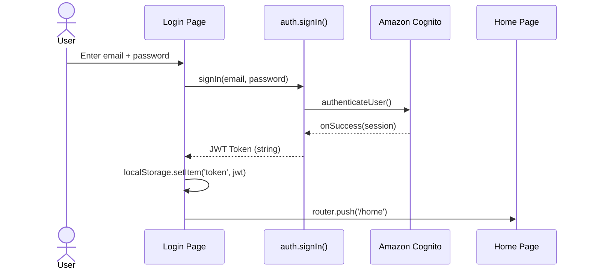
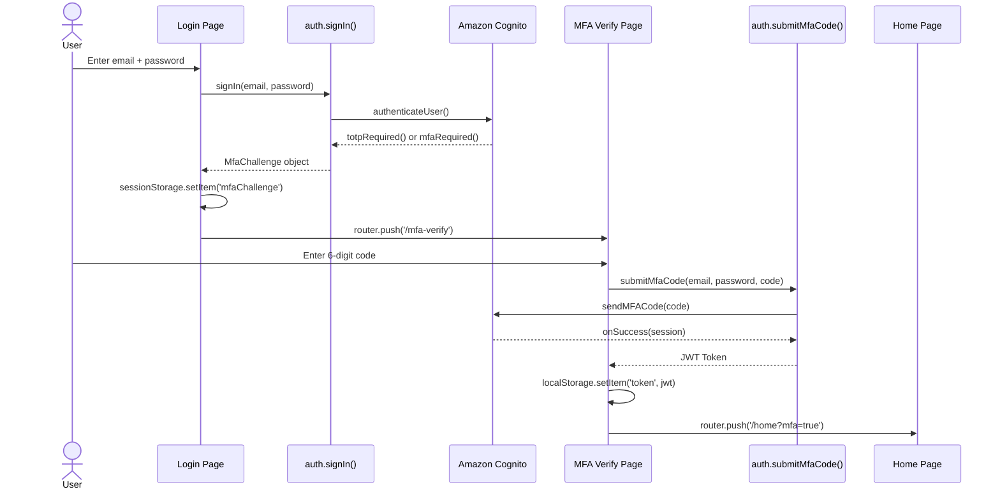
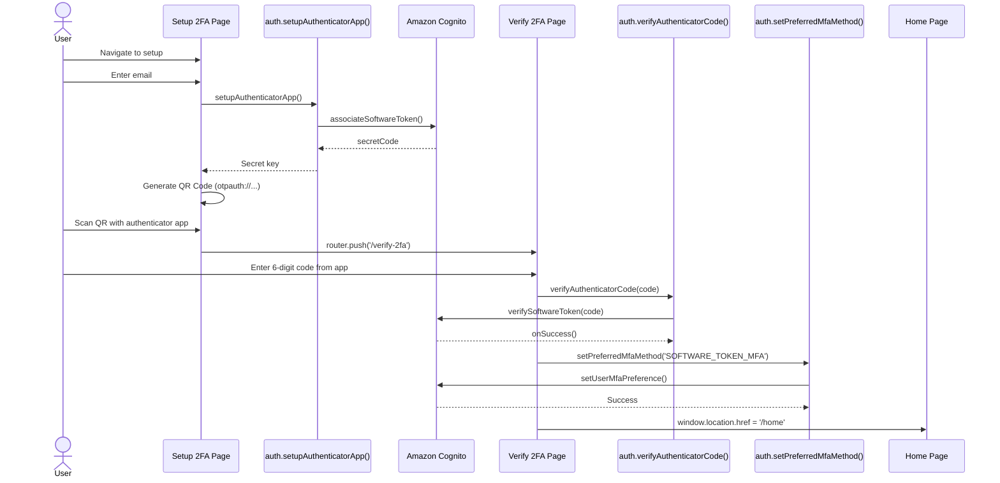

# Architecture Documentation: Next.js Amazon Cognito 2FA Application

## Table of Contents
1. [System Architecture Overview](#system-architecture-overview)
2. [Technology Stack Details](#technology-stack-details)
3. [Application Architecture Pattern](#application-architecture-pattern)
4. [Component Architecture](#component-architecture)
5. [Authentication Flow Architecture](#authentication-flow-architecture)
6. [Data Flow](#data-flow)
7. [State Management](#state-management)
8. [Security Architecture](#security-architecture)
9. [Deployment Architecture](#deployment-architecture)

---

## System Architecture Overview

This application follows a **Client-Side SPA with Serverless Authentication** architecture pattern, leveraging Amazon Cognito as the authentication and user management backend.

### High-Level Architecture Diagram

```
┌─────────────────────────────────────────────────────────────┐
│                        Browser Client                        │
│  ┌────────────────────────────────────────────────────────┐ │
│  │           Next.js Pages Router Application              │ │
│  │  ┌──────────────┐  ┌──────────────┐  ┌──────────────┐ │ │
│  │  │   UI Pages   │  │  Components  │  │   Services   │ │ │
│  │  │              │  │              │  │              │ │ │
│  │  │ - Login      │  │ - LoginForm  │  │ - auth.ts    │ │ │
│  │  │ - Setup 2FA  │  │ - MFA Forms  │  │ - config     │ │ │
│  │  │ - Home       │  │ - QR Setup   │  │              │ │ │
│  │  └──────────────┘  └──────────────┘  └──────────────┘ │ │
│  │                                                          │ │
│  │              localStorage (JWT Tokens)                  │ │
│  │              sessionStorage (MFA Challenges)            │ │
│  └────────────────────────────────────────────────────────┘ │
└─────────────────────────────────────────────────────────────┘
                              │
                              │ HTTPS / AWS SDK
                              ▼
┌─────────────────────────────────────────────────────────────┐
│                         AWS Cloud                            │
│  ┌────────────────────────────────────────────────────────┐ │
│  │                   Amazon Cognito                        │ │
│  │  ┌──────────────────────────────────────────────────┐  │ │
│  │  │              User Pool                           │  │ │
│  │  │  - User Management                               │  │ │
│  │  │  - Password Authentication                       │  │ │
│  │  │  - MFA Management (TOTP + SMS)                   │  │ │
│  │  │  - JWT Token Generation                          │  │ │
│  │  │  - Session Management                            │  │ │
│  │  └──────────────────────────────────────────────────┘  │ │
│  │                                                          │ │
│  │  ┌──────────────────────────────────────────────────┐  │ │
│  │  │              Amazon SNS                          │  │ │
│  │  │  - SMS Delivery for MFA Codes                    │  │ │
│  │  └──────────────────────────────────────────────────┘  │ │
│  └────────────────────────────────────────────────────────┘ │
└─────────────────────────────────────────────────────────────┘
```

### Architecture Characteristics

- **Type**: Client-Side SPA with Serverless Backend
- **Pattern**: Pages Router (file-based routing)
- **Deployment**: Static export with client-side hydration
- **Backend**: Fully managed by Amazon Cognito (no custom API)
- **State**: Client-side (localStorage + sessionStorage)

---

## Technology Stack Details

### Frontend Framework Stack

```typescript
// Core Framework
Next.js 16.0.3 (Pages Router)
  └─ React 19.2.0
      └─ React DOM 19.2.0

// Language & Tooling
TypeScript 5.x
  └─ Strict mode enabled
  └─ Path aliases: @/* → ./src/*

// Styling
Tailwind CSS 4.x
  └─ PostCSS integration
  └─ Utility-first CSS
  └─ Custom design tokens
```

### Authentication Stack

```typescript
// AWS SDK
amazon-cognito-identity-js@6.3.16
  ├─ CognitoUserPool
  ├─ CognitoUser
  ├─ AuthenticationDetails
  └─ MFA Session Management

// QR Code Generation
qrcode.react@4.2.0
  └─ qrcode@1.5.4
```

### Development Stack

```typescript
// Linting & Code Quality
ESLint 9.x
  └─ eslint-config-next@16.0.3

// Type Definitions
@types/react@19
@types/react-dom@19
@types/node@20
@types/qrcode@1.5.6
```

---

## Application Architecture Pattern

### Pages Router Architecture

```
Pages Router Flow:
  URL Request → Next.js Router → Page Component → Render
                                        ↓
                                Components + Services
                                        ↓
                                  Amazon Cognito API
```

### Page Component Hierarchy

```
_app.tsx (Root App Wrapper)
  └─ _document.tsx (HTML Document)
      ├─ index.tsx (Landing/Router)
      ├─ login.tsx (Login Page)
      │   └─ LoginForm Component
      │       └─ auth.signIn() service
      ├─ mfa-verify.tsx (MFA Verification)
      │   └─ MfaVerificationForm Component
      │       └─ auth.submitMfaCode() service
      ├─ setup-2fa.tsx (Authenticator Setup)
      │   └─ AuthenticatorSetup Component
      │       └─ auth.setupAuthenticatorApp() service
      ├─ verify-2fa.tsx (Setup Verification)
      │   └─ VerifyAuthenticator Component
      │       └─ auth.verifyAuthenticatorCode() service
      │       └─ auth.setPreferredMfaMethod() service
      └─ home.tsx (Protected Home)
          └─ JWT Token Validation
```

---

## Component Architecture

### Component Organization

#### **1. Form Components** (User Input Handling)

```typescript
LoginForm
├─ Props: { onLoginSuccess: (email, password) => Promise<void> }
├─ State: email, password, loading, error
└─ Behavior: Captures credentials, triggers authentication

MfaVerificationForm
├─ Props: { mfaChallenge: MfaChallenge, onSuccess?: () => void }
├─ State: code, loading, error, success
└─ Behavior: Captures MFA code, submits verification

VerifyAuthenticator
├─ Props: None (self-contained)
├─ State: code, loading, error, success
└─ Behavior: Verifies TOTP setup, enables MFA preference
```

#### **2. Setup Components** (Configuration & Enrollment)

```typescript
AuthenticatorSetup
├─ Props: { onComplete?: () => void, onCancel?: () => void }
├─ State: secretKey, qrCodeUrl, loading, userEmail, step
└─ Behavior: 
    - Generates secret key from Cognito
    - Creates QR code for authenticator apps
    - Provides manual key entry fallback
```

### Component Communication Pattern

```
Page Component
  │
  ├─ Passes callbacks to child components
  │   └─ onLoginSuccess, onComplete, onSuccess
  │
  ├─ Receives events from children
  │   └─ Handles navigation (useRouter)
  │
  └─ Coordinates with services
      └─ auth.ts service layer
          └─ Amazon Cognito SDK
```

---

## Authentication Flow Architecture

### Flow 1: Initial Login (No MFA)



### Flow 2: Login with MFA Challenge



### Flow 3: TOTP Setup



---

## Data Flow

### Authentication Data Flow

```
Input Layer (User)
  ↓
UI Components (Forms)
  ↓
Service Layer (auth.ts)
  ↓
AWS SDK Layer (amazon-cognito-identity-js)
  ↓
Network Layer (HTTPS)
  ↓
Amazon Cognito (Cloud)
  ↓
Response Flow (reverse order)
  ↓
JWT Token / MFA Challenge
  ↓
Client Storage (localStorage/sessionStorage)
```

### Data Storage Strategy

| Data Type | Storage Location | Persistence | Security |
|-----------|-----------------|-------------|----------|
| JWT Token | `localStorage` | Until logout | Client-side only |
| MFA Challenge | `sessionStorage` | Until page close | Temporary |
| User Email (QR) | Component state | During setup | Runtime only |
| Secret Key | Component state | During setup | Runtime only |

---

## State Management

### State Management Approach

**React Component State + Browser Storage**

No global state management library (Redux, Zustand, etc.) is used. State is managed through:

1. **Component-Level State** (useState hooks)
   - Form inputs
   - Loading states
   - Error messages
   - Success flags

2. **Browser Storage**
   - `localStorage`: JWT tokens (persistent)
   - `sessionStorage`: MFA challenges (temporary)

3. **URL State** (Next.js Router)
   - Query parameters (e.g., `?mfa=true`)
   - Route-based state

### State Flow Example

```typescript
// Login Component State
const [email, setEmail] = useState("");
const [password, setPassword] = useState("");

// Authentication Result → Storage
const result = await signIn(email, password);
if (typeof result === 'string') {
  localStorage.setItem('token', result); // Persistent
} else {
  sessionStorage.setItem('mfaChallenge', JSON.stringify(result)); // Temporary
}
```

---

## Security Architecture

### Security Layers

```
Layer 1: Amazon Cognito (Backend Security)
  ├─ User Pool Security
  ├─ Password Policies
  ├─ MFA Enforcement
  ├─ JWT Signature Validation
  └─ Rate Limiting

Layer 2: Application Security
  ├─ HTTPS Only
  ├─ Environment Variables (not hardcoded)
  ├─ Type Guards for Error Handling
  └─ Client-Side Route Protection

Layer 3: Code Security
  ├─ TypeScript Type Safety
  ├─ Input Validation
  ├─ Error Boundary Handling
  └─ No Sensitive Data in Console (production)
```

### Authentication Security

1. **Password Authentication**
   - Managed entirely by Amazon Cognito
   - No password storage in frontend
   - Secure transmission via HTTPS

2. **MFA Security**
   - TOTP: RFC 6238 compliant (30-second intervals)
   - SMS: AWS SNS with verified numbers
   - One-time use codes

3. **Session Security**
   - JWT tokens with expiration
   - Tokens stored in localStorage (⚠️ XSS vulnerable - see recommendations)
   - Manual logout clears tokens

### Security Recommendations for Production

```typescript
// Current (Development)
localStorage.setItem('token', jwt);

// Recommended (Production)
// Use httpOnly cookies set server-side
document.cookie = `authToken=${jwt}; Secure; HttpOnly; SameSite=Strict`;
```

**Production Security Checklist:**
- [ ] Move to httpOnly cookies for JWT storage
- [ ] Implement CSRF protection
- [ ] Add Content Security Policy headers
- [ ] Enable HTTPS redirect
- [ ] Add rate limiting
- [ ] Implement token refresh mechanism
- [ ] Remove console.log in production builds
- [ ] Add security headers (Helmet.js or Next.js headers)

---

## Deployment Architecture

### Recommended Deployment: Vercel

```
GitHub Repository
  ↓ (git push)
Vercel CI/CD
  ↓
Build Process
  ├─ npm install
  ├─ TypeScript compilation
  ├─ Next.js build
  └─ Static optimization
  ↓
Deployment
  ├─ Edge Network (CDN)
  ├─ Serverless Functions (API routes if added)
  └─ Environment Variables
  ↓
Production URL
  ↓
Amazon Cognito (External)
```

### Deployment Configuration

**Environment Variables (Vercel/Platform):**
```bash
NEXT_PUBLIC_COGNITO_USER_POOL_ID=us-east-1_xxxxxxxxx
NEXT_PUBLIC_COGNITO_CLIENT_ID=xxxxxxxxxxxxxxxxxxxxxxxxxx
NEXT_PUBLIC_APP_NAME=ProductionAppName
```

**Build Configuration:**
```json
{
  "scripts": {
    "dev": "next dev",
    "build": "next build",
    "start": "next start",
    "lint": "eslint"
  }
}
```

### Alternative Deployment Options

| Platform | Pros | Cons |
|----------|------|------|
| **Vercel** | Native Next.js support, auto-deploy | Vendor lock-in |
| **AWS Amplify** | AWS ecosystem integration | More complex setup |
| **Netlify** | Easy setup, good DX | Less Next.js optimization |
| **Self-hosted** | Full control | Requires infrastructure management |

---

## Performance Considerations

### Build Optimization

- **Static Generation**: Pages pre-rendered at build time where possible
- **Code Splitting**: Automatic per-page code splitting by Next.js
- **Tree Shaking**: Unused code removed in production builds
- **Minification**: JavaScript and CSS minified automatically

### Runtime Performance

- **Client-Side Rendering**: All pages are CSR (no SSR/SSG used)
- **Lazy Loading**: Components loaded on-demand
- **Image Optimization**: Can use Next.js Image component (not currently used)

### Future Performance Enhancements

1. Add Server-Side Rendering (SSR) for SEO-critical pages
2. Implement Incremental Static Regeneration (ISR)
3. Add Next.js Image optimization
4. Implement service worker for offline support
5. Add analytics and performance monitoring

---

## Scalability Architecture

### Current Scale

- **Users**: Unlimited (Amazon Cognito handles scaling)
- **Requests**: CDN-cached static assets
- **Geographic**: Global (via CDN)

### Scaling Considerations

Since this is a serverless architecture with Amazon Cognito:

✅ **Auto-Scaling**
  - Amazon Cognito scales automatically
  - No backend servers to manage
  - CDN handles traffic spikes

✅ **High Availability**
  - Multi-region AWS infrastructure
  - CDN redundancy
  - No single point of failure

⚠️ **Limits to Monitor**
  - Amazon Cognito rate limits (adjustable)
  - SMS sending limits (AWS SNS)
  - localStorage size limits (browser-dependent)

---

## Technology Decisions Rationale

### Why Pages Router (Not App Router)?

✅ Simpler client-side authentication flow  
✅ No need for Server Components  
✅ Established patterns for Cognito integration  
✅ Better support for client-side state management  

### Why No Custom Backend?

✅ Amazon Cognito provides complete auth solution  
✅ Reduced infrastructure complexity  
✅ Lower operational costs  
✅ Enterprise-grade security out of box  

### Why localStorage for JWT?

⚠️ Quick development/demonstration  
⚠️ Simple implementation  
❌ **Not recommended for production** (use httpOnly cookies)  

---

**Document Version**: 1.0  
**Last Updated**: November 19, 2025  
**Architecture Type**: Client-Side SPA + Serverless Authentication  
**Next Review**: When adding new features or deployment changes
