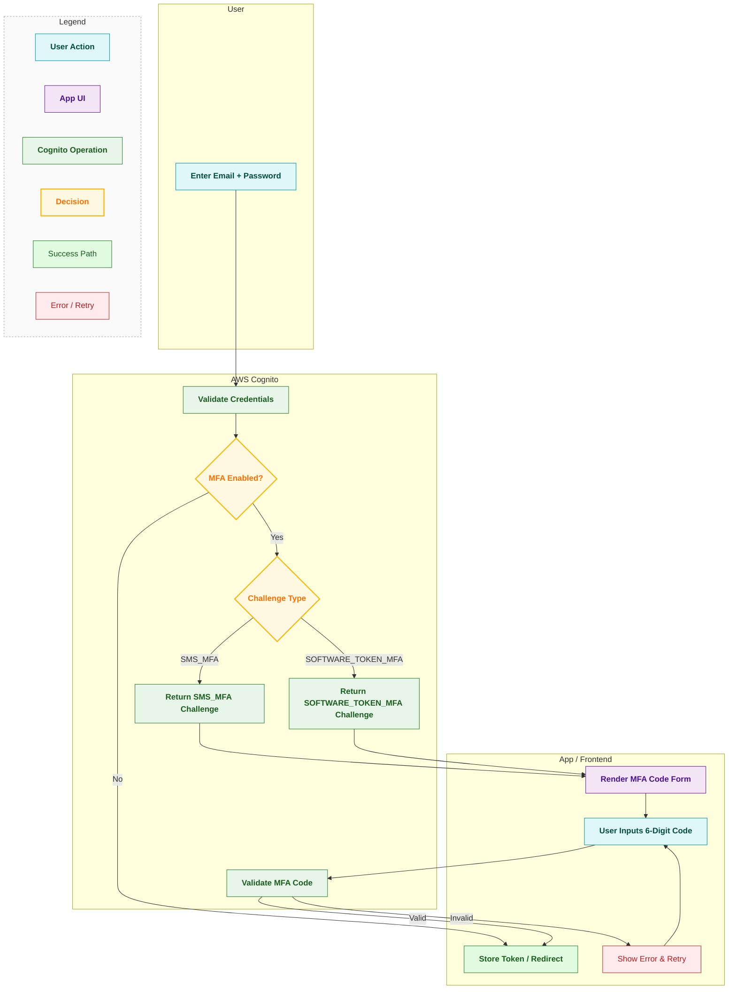
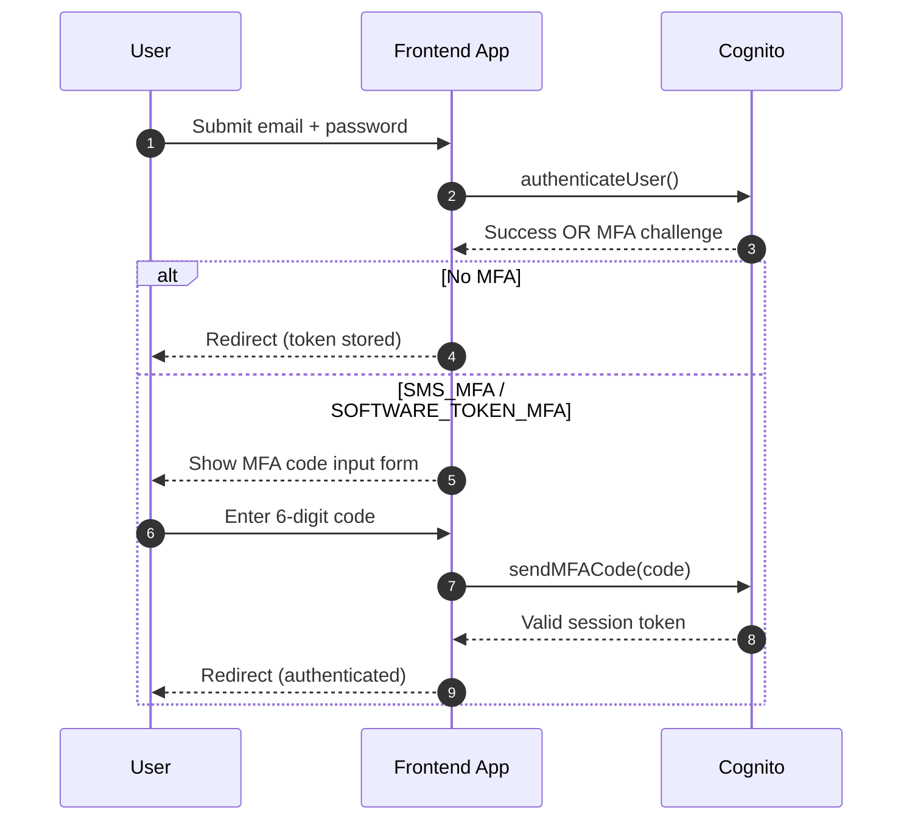

# How to Implement Two-Factor Authentication (2FA) with AWS Cognito in Next.js

> **Author**: Senior Developer  
> **Last Updated**: November 16, 2025 16:15
> **Reading Time**: 15 minutes  
> **Difficulty**: Intermediate  
> **Prerequisites**: Basic knowledge of React, AWS Cognito, and TypeScript

## Table of Contents

1. [Introduction](#introduction)
2. [What is Two-Factor Authentication and Why Does It Matter?](#what-is-two-factor-authentication-and-why-does-it-matter)
3. [AWS Cognito Setup Requirements](#aws-cognito-setup-requirements)
4. [Understanding the AWS Cognito 2FA Authentication Flow](#understanding-the-aws-cognito-2fa-authentication-flow)
5. [Step-by-Step Implementation Guide](#step-by-step-implementation-guide)
   - [Step 1: Install Required AWS Cognito Dependencies](#step-1-install-required-aws-cognito-dependencies)
   - [Step 2: Configure Your Cognito User Pool Connection](#step-2-configure-your-cognito-user-pool-connection)
   - [Step 3: Build the Core Sign-In Function with MFA Detection](#step-3-build-the-core-sign-in-function-with-mfa-detection)
   - [Step 4: Create the Login Form UI with MFA Challenge Handling](#step-4-create-the-login-form-ui-with-mfa-challenge-handling)
   - [Step 5: Implement MFA Code Submission to AWS Cognito](#step-5-implement-mfa-code-submission-to-aws-cognito)
   - [Step 6: Enable Authenticator App Setup with QR Code Generation](#step-6-enable-authenticator-app-setup-with-qr-code-generation)
   - [Step 7: Verify Authenticator Setup and Set MFA Preferences](#step-7-verify-authenticator-setup-and-set-mfa-preferences)
6. [Testing Your AWS Cognito 2FA Implementation](#testing-your-aws-cognito-2fa-implementation)
7. [Common Issues and Troubleshooting Solutions](#common-issues-and-troubleshooting-solutions)
8. [Security Best Practices for Production 2FA](#security-best-practices-for-production-2fa)
9. [Essential Resources and Further Reading](#essential-resources-and-further-reading)
10. [Conclusion: Secure Your Next.js Application with AWS Cognito 2FA](#conclusion-secure-your-nextjs-application-with-aws-cognito-2fa)

---

## Introduction

This guide shows you how to add an extra security layer that protects user accounts from unauthorized access, even when passwords are compromised.

This tutorial focuses on authenticator app (TOTP) implementation for simplicity and enhanced security. While AWS Cognito also supports SMS verification, only verified numbers are allowed to send messages. If you want to send to unverified numbers, you'll need to request production access.

**What You'll Learn:**

- Implement TOTP (Time-based One-Time Password) with Google Authenticator and similar apps
- Handle MFA challenges during user login
- Configure and verify authenticator-based 2FA
- Generate and display QR codes for easy setup

---

## What is Two-Factor Authentication and Why Does It Matter?

Two-Factor Authentication (2FA) strengthens your application's security by requiring two distinct forms of verification:

1. **Something Users Know** - Their username and password
2. **Something Users Have** - A time-sensitive verification code from authenticator apps like Google Authenticator or Microsoft Authenticator

**Why 2FA is Critical for Security:**

Even if attackers steal user passwords through phishing or data breaches, they cannot access accounts without the second authentication factor. This makes 2FA one of the most effective defenses against unauthorized account access.

---

## AWS Cognito Setup Requirements

Before implementing 2FA in your Next.js application, you need to configure AWS Cognito properly. This section outlines the essential prerequisites.

### Quick Setup Overview

For detailed step-by-step AWS Console instructions, refer to our [Detailed AWS Cognito 2FA Setup Guide](aws-2fa-setup.md). This keeps the article focused on code implementation while ensuring you have access to comprehensive setup instructions.

**Required AWS Resources:**

- **Cognito User Pool** with MFA set to "Optional"
- **App Client** configured for Software Token MFA (TOTP)
- **User Pool ID and App Client ID** credentials

**Essential Documentation:**

- [AWS Cognito User Pool Creation Guide](https://docs.aws.amazon.com/cognito/)
- [AWS SNS SMS Sandbox Exit Process](https://docs.aws.amazon.com/sns/)
- [Internal Setup Guide: AWS Cognito 2FA Configuration](aws-2fa-setup.md)

**Important Environment Variables:**

After AWS setup, you'll need these environment variables in your application:

```bash
# .env.local (for Next.js App Router)
NEXT_PUBLIC_COGNITO_USER_POOL_ID=us-east-1_xxxxxxxxx
NEXT_PUBLIC_COGNITO_CLIENT_ID=xxxxxxxxxxxxxxxxxxxxxxxxxx
NEXT_PUBLIC_APP_NAME=YourAppName
```

> **Note for Next.js App Router**: Environment variables that need to be accessible in the browser must be prefixed with `NEXT_PUBLIC_`. Since Cognito authentication happens client-side, all variables require this prefix.
>
> **App Name Configuration**: The `NEXT_PUBLIC_APP_NAME` variable sets the issuer name displayed in authenticator apps. This helps users identify which account the TOTP code belongs to.

---

## Understanding the AWS Cognito 2FA Authentication Flow

Visualize how users authenticate with multi-factor verification. These diagrams map the complete login process, from initial credentials to MFA verification.

### Login Flow with Conditional MFA



### Sequence Diagram (Login With MFA)



---

## Step-by-Step Implementation Guide

Follow this comprehensive walkthrough to add AWS Cognito 2FA to your Next.js application. Each step builds on the previous one, creating a complete authentication system.

### Step 1: Install Required AWS Cognito Dependencies

Start by installing the AWS Cognito Identity SDK for JavaScript, which provides all the authentication methods you'll need:

```bash
npm install amazon-cognito-identity-js
# or
yarn add amazon-cognito-identity-js
```

For QR code generation (for authenticator setup):

```bash
npm install qrcode.react
# or
yarn add qrcode.react
```

### Step 2: Configure Your Cognito User Pool Connection

Create a configuration file that connects your Next.js app to AWS Cognito. This centralizes your User Pool credentials and makes them reusable across your application:

```typescript
// config/cognito.ts
import { CognitoUserPool } from "amazon-cognito-identity-js";

export const userPool = new CognitoUserPool({
  UserPoolId: process.env.NEXT_PUBLIC_COGNITO_USER_POOL_ID || "",
  ClientId: process.env.NEXT_PUBLIC_COGNITO_CLIENT_ID || "",
});
```

### Step 3: Build the Core Sign-In Function with MFA Detection

Create a sign-in function that authenticates users and automatically detects when MFA verification is required. This function returns either a JWT token for successful authentication or an MFA challenge object when additional verification is needed:

```typescript
// services/auth.ts
import { AuthenticationDetails, CognitoUser } from "amazon-cognito-identity-js";
import { userPool } from "../config/cognito";

// Define types for MFA challenge
export interface MfaChallenge {
  email: string;
  password: string;
  challengeName: "SMS_MFA" | "SOFTWARE_TOKEN_MFA";
  challengeParameters: {
    CODE_DELIVERY_DELIVERY_MEDIUM?: string;
    CODE_DELIVERY_DESTINATION?: string;
  };
}

// Sign in function that returns either a token or an MFA challenge
export const signIn = (
  email: string,
  password: string
): Promise<string | MfaChallenge> => {
  return new Promise((resolve, reject) => {
    // Create authentication details
    const authenticationDetails = new AuthenticationDetails({
      Username: email,
      Password: password,
    });

    // Create Cognito user
    const cognitoUser = new CognitoUser({
      Username: email,
      Pool: userPool,
    });

    // Attempt authentication
    cognitoUser.authenticateUser(authenticationDetails, {
      // Success: User doesn't have MFA or MFA was already completed
      onSuccess: (result) => {
        const token = result.getIdToken().getJwtToken();
        resolve(token);
      },

      // MFA Required: SMS code will be sent
      mfaRequired: (challengeName, challengeParameters) => {
        resolve({
          email,
          password,
          challengeName: "SMS_MFA" as const,
          challengeParameters,
        });
      },

      // TOTP Required: User must use authenticator app
      totpRequired: (challengeName, challengeParameters) => {
        resolve({
          email,
          password,
          challengeName: "SOFTWARE_TOKEN_MFA" as const,
          challengeParameters,
        });
      },

      // Failed authentication
      onFailure: (err) => {
        reject(err);
      },
    });
  });
};
```

**How This Function Works:**

- **`onSuccess`**: Fires when login succeeds without MFA or after MFA completion
- **`mfaRequired`**: Triggers when the user has SMS MFA enabled
- **`totpRequired`**: Triggers when the user has authenticator app (TOTP) MFA enabled
- **Return value**: Either a JWT token (string) for immediate access or an MFA challenge object requiring verification

### Step 4: Create the Login Form UI with MFA Challenge Handling

Build a React component that manages the login form and dynamically switches to MFA verification when needed. This component detects authentication responses and renders the appropriate interface:

```typescript
// components/LoginForm.tsx
import React, { useState } from "react";
import { signIn, MfaChallenge } from "../services/auth";

const LoginForm = () => {
  const [email, setEmail] = useState("");
  const [password, setPassword] = useState("");
  const [mfaChallenge, setMfaChallenge] = useState<MfaChallenge | null>(null);

  const handleLogin = async (e: React.FormEvent) => {
    e.preventDefault();

    try {
      const result = await signIn(email, password);

      // Check if result is a token (string) or MFA challenge (object)
      if (typeof result === "string") {
        // Login successful - result is the JWT token
        localStorage.setItem("token", result);
        window.location.href = "/dashboard";
      } else {
        // MFA required - store challenge for verification
        setMfaChallenge(result);
      }
    } catch (error) {
      console.error("Login failed:", error);
    }
  };

  // If MFA challenge exists, show verification form
  if (mfaChallenge) {
    return <MfaVerificationForm mfaChallenge={mfaChallenge} />;
  }

  // Otherwise, show login form
  return (
    <form onSubmit={handleLogin}>
      <input
        type="email"
        value={email}
        onChange={(e) => setEmail(e.target.value)}
        required
      />
      <input
        type="password"
        value={password}
        onChange={(e) => setPassword(e.target.value)}
        required
      />
      <button type="submit">Login</button>
    </form>
  );
};
```

### Step 5: Implement MFA Code Submission to AWS Cognito

Create a function that submits the user's MFA verification code to AWS Cognito. This handles both SMS codes and authenticator app (TOTP) codes:

```typescript
// services/auth.ts (continued)

export const submitMfaCode = (
  email: string,
  password: string,
  code: string,
  mfaType?: "SMS_MFA" | "SOFTWARE_TOKEN_MFA"
): Promise<string> => {
  return new Promise((resolve, reject) => {
    // Recreate authentication details and user
    const authenticationDetails = new AuthenticationDetails({
      Username: email,
      Password: password,
    });

    const cognitoUser = new CognitoUser({
      Username: email,
      Pool: userPool,
    });

    // Restart authentication to get into MFA state
    cognitoUser.authenticateUser(authenticationDetails, {
      onSuccess: (session) => {
        const token = session.getIdToken().getJwtToken();
        resolve(token);
      },
      mfaRequired: () => {
        // Now send the MFA code
        cognitoUser.sendMFACode(
          code,
          {
            onSuccess: (session) => {
              const token = session.getIdToken().getJwtToken();
              resolve(token);
            },
            onFailure: (err) => {
              reject(err);
            },
          },
          mfaType
        );
      },
      totpRequired: () => {
        // Now send the MFA code for TOTP
        cognitoUser.sendMFACode(
          code,
          {
            onSuccess: (session) => {
              const token = session.getIdToken().getJwtToken();
              resolve(token);
            },
            onFailure: (err) => {
              reject(err);
            },
          },
          mfaType
        );
      },
      onFailure: (err) => {
        reject(err);
      },
    });
  });
};
```

Now create the verification form component:

```typescript
// components/MfaVerificationForm.tsx
import React, { useState } from "react";
import { submitMfaCode, MfaChallenge } from "../services/auth";

interface Props {
  mfaChallenge: MfaChallenge;
}

const MfaVerificationForm: React.FC<Props> = ({ mfaChallenge }) => {
  const [code, setCode] = useState("");

  const handleSubmit = async (e: React.FormEvent) => {
    e.preventDefault();

    try {
      const token = await submitMfaCode(
        mfaChallenge.email,
        mfaChallenge.password,
        code,
        mfaChallenge.challengeName
      );

      // Save token and redirect
      localStorage.setItem("token", token);
      window.location.href = "/dashboard";
    } catch (error) {
      console.error("Verification failed:", error);
    }
  };

  return (
    <form onSubmit={handleSubmit}>
      <h2>Enter Verification Code</h2>
      <p>
        {mfaChallenge.challengeName === "SMS_MFA"
          ? `Code sent to ${mfaChallenge.challengeParameters.CODE_DELIVERY_DESTINATION}`
          : "Enter the code from your authenticator app"}
      </p>
      <input
        type="text"
        value={code}
        onChange={(e) => setCode(e.target.value)}
        maxLength={6}
        required
      />
      <button type="submit">Verify</button>
    </form>
  );
};

export default MfaVerificationForm;
```

### Step 6: Enable Authenticator App Setup with QR Code Generation

Implement the TOTP setup process that allows users to link their authenticator apps. This involves three key steps:

1. Request a secret key from AWS Cognito
2. Generate a scannable QR code or provide manual entry
3. Display the setup interface to users

```typescript
// services/auth.ts (continued)

export const setupAuthenticatorApp = (): Promise<string> => {
  return new Promise((resolve, reject) => {
    // Get the current logged-in user
    const cognitoUser = userPool.getCurrentUser();

    if (!cognitoUser) {
      reject(new Error("No user is currently logged in"));
      return;
    }

    // Ensure user session is valid
    cognitoUser.getSession((err: Error | null) => {
      if (err) {
        reject(err);
        return;
      }

      // Request a software token (secret key) from Cognito
      cognitoUser.associateSoftwareToken({
        associateSecretCode: (secretCode) => {
          // This is the secret key that will be used to generate the QR code
          resolve(secretCode);
        },
        onFailure: (err) => {
          reject(err);
        },
      });
    });
  });
};
```

Now create a component to display the QR code:

```typescript
// components/AuthenticatorSetup.tsx
import React, { useState } from "react";
import { QRCodeSVG } from "qrcode.react";
import { setupAuthenticatorApp } from "../services/auth";

const AuthenticatorSetup = () => {
  const [secretKey, setSecretKey] = useState<string | null>(null);
  const [qrCodeUrl, setQrCodeUrl] = useState<string | null>(null);
  const [userEmail, setUserEmail] = useState("");

  const handleGenerateQR = async (e: React.FormEvent) => {
    e.preventDefault();

    try {
      // Get secret key from Cognito
      const secret = await setupAuthenticatorApp();
      setSecretKey(secret);

      // Generate QR code URL
      // Format: otpauth://totp/Issuer:Account?secret=SECRET&issuer=Issuer
      const issuer = process.env.NEXT_PUBLIC_APP_NAME || "MyApp";
      const qrUrl = `otpauth://totp/${encodeURIComponent(
        issuer
      )}:${encodeURIComponent(
        userEmail
      )}?secret=${secret}&issuer=${encodeURIComponent(issuer)}`;

      setQrCodeUrl(qrUrl);
    } catch (error) {
      console.error("Failed to setup authenticator:", error);
    }
  };

  if (!qrCodeUrl) {
    return (
      <form onSubmit={handleGenerateQR}>
        <input
          type="email"
          value={userEmail}
          onChange={(e) => setUserEmail(e.target.value)}
          placeholder="user@example.com"
          required
        />
        <button type="submit">Generate QR Code</button>
      </form>
    );
  }

  return (
    <div>
      <h3>Scan QR Code</h3>
      <QRCodeSVG value={qrCodeUrl} size={200} />
      <p>Or manually enter this secret key:</p>
      <code>{secretKey}</code>
    </div>
  );
};

export default AuthenticatorSetup;
```

**How This Integrates with AWS Cognito:**

- **`setupAuthenticatorApp()`** - Invokes `cognitoUser.associateSoftwareToken()` to retrieve a cryptographic secret from AWS Cognito
- **Secret Key Usage** - AWS Cognito generates this secret to create TOTP codes that authenticator apps can validate
- **QR Code Protocol** - Uses the industry-standard `otpauth://` URI format that all major authenticator apps recognize

**Decoding the QR Code Format:**

Authenticator apps scan a URL structured like this:

```
otpauth://totp/MyApp:user@example.com?secret=SECRETKEY&issuer=MyApp
```

**Format Components:**

- **`otpauth://totp/`** - Specifies the TOTP (Time-based OTP) protocol
- **`MyApp:user@example.com`** - Combines the issuer name with the user's account identifier
- **`secret=SECRETKEY`** - Contains the cryptographic secret key from AWS Cognito
- **`issuer=MyApp`** - Displays your application name in the authenticator app

### Step 7: Verify Authenticator Setup and Set MFA Preferences

Complete the 2FA setup by verifying that users can generate valid codes from their authenticator app. This step confirms the secret key was correctly registered and allows you to set the user's preferred MFA method:

```typescript
// services/auth.ts (continued)

export const verifyAuthenticatorCode = (
  code: string,
  deviceName: string = "MyDevice"
): Promise<void> => {
  return new Promise((resolve, reject) => {
    const cognitoUser = userPool.getCurrentUser();

    if (!cognitoUser) {
      reject(new Error("No user is currently logged in"));
      return;
    }

    cognitoUser.getSession((err: Error | null) => {
      if (err) {
        reject(err);
        return;
      }

      // Verify the TOTP code
      cognitoUser.verifySoftwareToken(code, deviceName, {
        onSuccess: () => {
          resolve();
        },
        onFailure: (err) => {
          reject(err);
        },
      });
    });
  });
};

// After verification, set the preferred MFA method
export const setPreferredMfaMethod = (
  method: "SMS_MFA" | "SOFTWARE_TOKEN_MFA"
): Promise<void> => {
  return new Promise((resolve, reject) => {
    const cognitoUser = userPool.getCurrentUser();

    if (!cognitoUser) {
      reject(new Error("No user is currently logged in"));
      return;
    }

    cognitoUser.getSession((err: Error | null) => {
      if (err) {
        reject(err);
        return;
      }

      // Configure MFA preferences
      const smsSettings =
        method === "SMS_MFA"
          ? { Enabled: true, PreferredMfa: true }
          : { Enabled: false, PreferredMfa: false };

      const totpSettings =
        method === "SOFTWARE_TOKEN_MFA"
          ? { Enabled: true, PreferredMfa: true }
          : { Enabled: false, PreferredMfa: false };

      cognitoUser.setUserMfaPreference(smsSettings, totpSettings, (err) => {
        if (err) {
          reject(err);
          return;
        }
        resolve();
      });
    });
  });
};
```

Create the verification component:

```typescript
// components/VerifyAuthenticator.tsx
import React, { useState } from "react";
import {
  verifyAuthenticatorCode,
  setPreferredMfaMethod,
} from "../services/auth";

const VerifyAuthenticator = () => {
  const [code, setCode] = useState("");

  const handleVerify = async (e: React.FormEvent) => {
    e.preventDefault();

    try {
      // Step 1: Verify the code from authenticator app
      await verifyAuthenticatorCode(code, "MyAuthenticatorDevice");

      // Step 2: Set authenticator as preferred MFA method
      await setPreferredMfaMethod("SOFTWARE_TOKEN_MFA");

      // Redirect to dashboard
      window.location.href = "/dashboard";
    } catch (error) {
      console.error("Verification failed:", error);
    }
  };

  return (
    <form onSubmit={handleVerify}>
      <h2>Verify Authenticator Setup</h2>
      <p>Enter the 6-digit code from your authenticator app:</p>
      <input
        type="text"
        value={code}
        onChange={(e) => setCode(e.target.value)}
        maxLength={6}
        required
      />
      <button type="submit">Verify and Enable 2FA</button>
    </form>
  );
};

export default VerifyAuthenticator;
```

---

## Testing Your AWS Cognito 2FA Implementation

**Test Scenario 1: QR Code Setup Process**

1. Navigate to the 2FA setup page
2. Verify the QR code displays correctly
3. Scan the code with Google Authenticator, Microsoft Authenticator, or Authy
4. Confirm the account appears in the authenticator app with the correct issuer name
5. Enter the 6-digit TOTP code to complete setup
6. Verify the success message and MFA preference update

**Test Scenario 2: Manual Secret Key Entry**

1. Access the 2FA setup page
2. Copy the manual secret key
3. Manually enter it in an authenticator app
4. Verify the generated codes match
5. Complete the verification process

**Test Scenario 3: Cross-Browser and Device Testing**

Test your implementation across:

- **Browsers**: Chrome, Firefox, Safari, Edge
- **Devices**: Desktop, tablet, mobile (iOS and Android)
- **Operating Systems**: macOS, Windows, Linux, iOS, Android

---

## Security Best Practices for Production 2FA

### Secure Token Storage

Store JWT tokens securely and implement proper session management:

```typescript
// Use httpOnly cookies instead of localStorage for production
export const storeToken = (token: string) => {
  // For production, set this server-side
  document.cookie = `authToken=${token}; Secure; HttpOnly; SameSite=Strict; Max-Age=3600`;
};

// Clear tokens on logout
export const clearToken = () => {
  document.cookie = "authToken=; Secure; HttpOnly; SameSite=Strict; Max-Age=0";
};
```

**Important Security Notes:**

- Never store authentication tokens in `localStorage` - they're vulnerable to XSS attacks
- Use `httpOnly` cookies set server-side to prevent JavaScript access
- Always enforce HTTPS in production to protect tokens in transit
- Implement proper token expiration and refresh mechanisms

---

## Essential Resources and Further Reading

### AWS Cognito Official Documentation

- [AWS Cognito Developer Guide](https://docs.aws.amazon.com/cognito/) - Complete reference for AWS Cognito services
- [Amazon Cognito Identity SDK for JavaScript](https://github.com/aws-amplify/amplify-js/tree/main/packages/amazon-cognito-identity-js) - Official SDK documentation and examples
- [AWS Cognito Multi-Factor Authentication Configuration](https://docs.aws.amazon.com/cognito/latest/developerguide/user-pool-settings-mfa.html) - MFA setup guide

### Security Standards and Best Practices

- [OWASP Multi-Factor Authentication Cheat Sheet](https://cheatsheetseries.owasp.org/cheatsheets/Multifactor_Authentication_Cheat_Sheet.html) - Industry-standard security guidelines
- [RFC 6238 - TOTP Algorithm Specification](https://tools.ietf.org/html/rfc6238) - Technical specification for Time-Based One-Time Passwords

---

## Conclusion: Secure Your Next.js Application with AWS Cognito 2FA

Implementing authenticator-based Two-Factor Authentication with AWS Cognito significantly strengthens your application's security posture. You now have the knowledge to protect user accounts from unauthorized access, even when passwords are compromised.

**Key Implementation Takeaways:**

- **Enhanced Security**: Authenticator apps provide robust, time-based verification
- **User-Friendly**: QR code setup makes 2FA adoption simple for users
- **AWS Cognito Benefits**: Handles complex cryptography, token validation, and scaling automatically
- **Production-Ready**: Secure token storage ensures your implementation is safe for production use

**Next Steps:**

Thoroughly test your implementation across different devices and browsers. Monitor authentication metrics and gather user feedback to refine the experience. Always follow security best practices and keep your AWS Cognito SDK updated.

Ready to implement 2FA in your application? Start with the AWS setup guide and follow the step-by-step code examples provided above.
