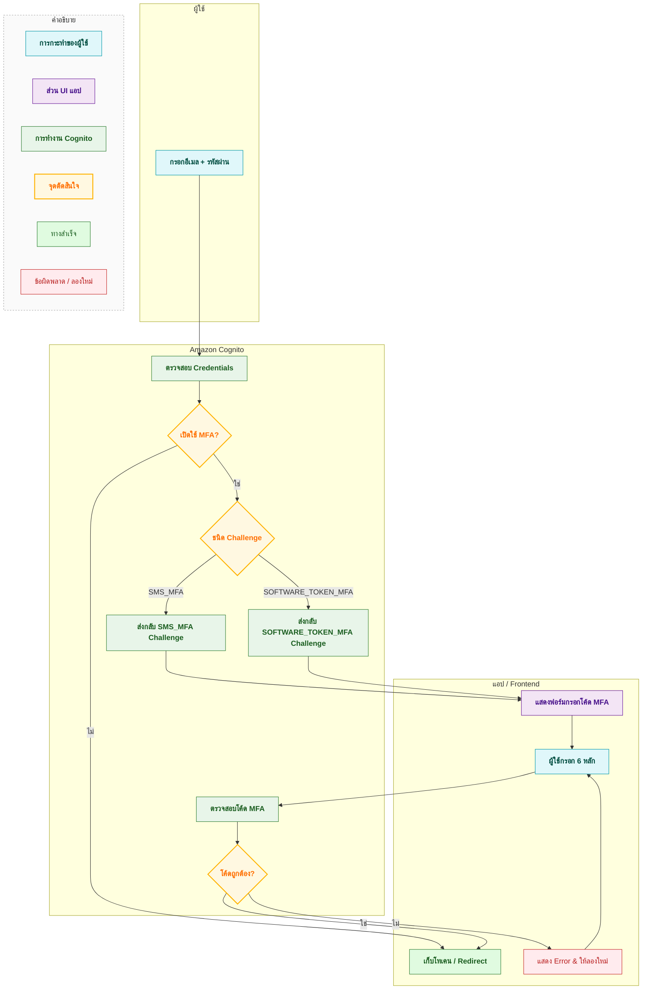
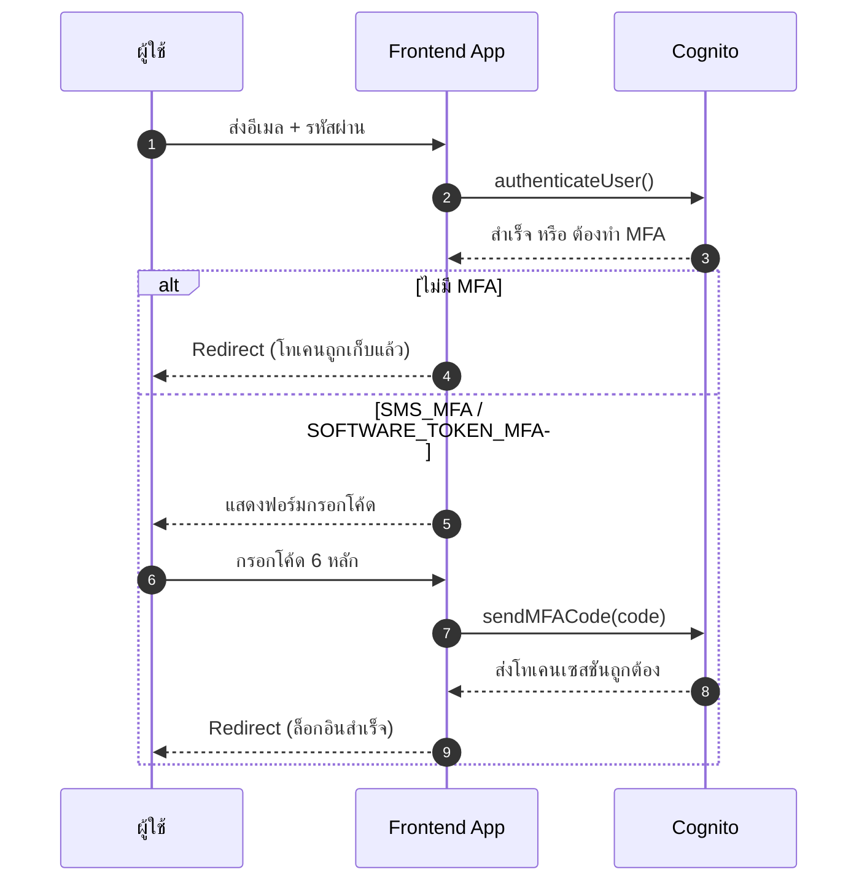

# วิธีเพิ่มความปลอดภัยด้วย Two-Factor Authentication (2FA) บน Next.js + Amazon Cognito {#introduction}

## สารบัญ

> **GitHub Repository**: โค้ดตัวอย่างครบทั้งโปรเจกต์สามารถดูได้ที่ [nextjs-aws-2fa](https://github.com/gamertense/nextjs-amazon-cognito)

1. [บทนำ](#introduction)
2. [2FA คืออะไร สำคัญยังไง](#what-is-two-factor-authentication-and-why-does-it-matter)
3. [ต้องเตรียมอะไรใน Amazon Cognito บ้าง](#aws-cognito-setup-requirements)
4. [มาดู Flow การล็อกอินแบบมี 2FA](#understanding-the-amazon-cognito-2fa-authentication-flow)
5. [ลงมือทำทีละขั้น](#step-by-step-implementation-guide)

- [ขั้นที่ 1: ติดตั้งแพ็กเกจที่ต้องใช้](#step-1-install-required-amazon-cognito-dependencies)
- [ขั้นที่ 2: ตั้งค่าเชื่อมต่อ User Pool](#step-2-configure-your-cognito-user-pool-connection)
- [ขั้นที่ 3: สร้างฟังก์ชัน Sign-In ที่ตรวจจับ MFA](#step-3-build-the-core-sign-in-function-with-mfa-detection)
- [ขั้นที่ 4: ทำฟอร์มล็อกอินให้รองรับ MFA Challenge](#step-4-create-the-login-form-ui-with-mfa-challenge-handling)
- [ขั้นที่ 5: ส่งโค้ด MFA กลับไปตรวจ](#step-5-implement-mfa-code-submission-to-amazon-cognito)
- [ขั้นที่ 6: ตั้งค่า Authenticator + สร้าง QR Code](#step-6-enable-authenticator-app-setup-with-qr-code-generation)
- [ขั้นที่ 7: ยืนยัน Authenticator แล้วเลือกวิธี MFA ที่ใช้](#step-7-verify-authenticator-setup-and-set-mfa-preferences)

6. [ทดสอบว่า 2FA ทำงานดี](#testing-your-amazon-cognito-2fa-implementation)
7. [ปัญหาที่มักเจอ + วิธีแก้](#common-issues-and-troubleshooting-solutions)
8. [Tips ความปลอดภัยตอนขึ้น Production](#security-best-practices-for-production-2fa)
9. [แหล่งอ้างอิง / อ่านเพิ่ม](#essential-resources-and-further-reading)
10. [สรุป + ก้าวต่อไป](#conclusion-secure-your-nextjs-application-with-amazon-cognito-2fa)

---

## บทนำ {#introduction}

บทความนี้ผมพาไปทำ 2FA แบบใช้แอป Authenticator บนมือถือได้เลย จริงๆ ทาง AWS เองก็มีบริการส่ง SMS ด้วยเช่นกัน เพียงแต่ถ้าอยากส่ง SMS ไปยังเบอร์ที่ยังไม่ได้ยืนยัน จะต้องขอ Production Access (เรียก exit sandbox) และจะมีค่าบริการครับ

**สิ่งที่จะได้จากบทความนี้:**

- เปิดใช้ TOTP กับ Google / Microsoft Authenticator / Authy ได้เลย
- รับมือ MFA Challenge ตอนล็อกอินแบบลื่นๆ
- ตั้งค่า + ยืนยันตัวตนผ่าน Authenticator
- สร้าง QR Code ให้ผู้ใช้สแกนง่าย ไม่ต้องกรอกเอง

---

## 2FA คืออะไร สำคัญยังไง {#what-is-two-factor-authentication-and-why-does-it-matter}

2FA (Two-Factor Authentication) คือการขอ “สองอย่าง” เพื่อยืนยันว่าเป็นเจ้าของบัญชีจริงๆ ครับ แทนที่จะใช้แค่รหัสผ่านอย่างเดียว

1. **สิ่งที่รู้** – อีเมล / รหัสผ่าน
2. **สิ่งที่ถืออยู่** – โค้ดเปลี่ยนตลอดจากแอป Authenticator

**ทำไมต้องมี 2FA?**
เพราะต่อให้รหัสผ่านหลุดจากการฟิชชิ่งหรือเว็บโดนเจาะ คนร้ายก็ยังติดขั้นที่สอง ไม่มีโค้ดก็เข้าไม่ได้ ลดเคสโดนยึดบัญชีครับ

---

## ต้องเตรียมอะไรใน Amazon Cognito บ้าง {#aws-cognito-setup-requirements}

ก่อนเขียนโค้ด มาตรวจเช็คลิสต์กันให้ครบกันว่าของพร้อม เพื่อไม่ให้บทความนี้ยาวเกินไป ผมแยกพาร์ทการตั้งค่าเป็นอีกบทความ [วิธีเปิด MFA บน Amazon Cognito](aws-2fa-setup.md) คลิ๊กไปดูได้เลยครับ

**สิ่งที่ต้องมีใน AWS:**

- สร้าง **Cognito User Pool** แล้วตั้ง MFA เป็น “Optional” (ให้เลือกเปิดเมื่อพร้อม)
- มี **App Client** ที่เปิด Software Token MFA (TOTP)
- จด **User Pool ID** + **App Client ID** ไว้ใช้เชื่อม

**Environment Variables ที่ต้องใส่:**

```bash
# .env.local (เพราะเราต้องใช้ค่าฝั่ง client ครับ)
NEXT_PUBLIC_COGNITO_USER_POOL_ID=us-east-1_xxxxxxxxx
NEXT_PUBLIC_COGNITO_CLIENT_ID=xxxxxxxxxxxxxxxxxxxxxxxxxx
NEXT_PUBLIC_APP_NAME=YourAppName
```

> **ทำไมต้องมี NEXT_PUBLIC**: ตัวแปรที่ต้องเข้าถึงจาก Browser ต้อง prefix นี้ครับ เพราะการ auth ของ Cognito ในตัวอย่างนี้เกิดฝั่ง client
> **APP NAME (Issuer)**: `NEXT_PUBLIC_APP_NAME` จะไปโผล่ในแอป Authenticator ให้ผู้ใช้เห็นว่าโค้ดนี้ของระบบไหนครับ

---

## มาดู Flow การล็อกอินแบบมี 2FA {#understanding-the-amazon-cognito-2fa-authentication-flow}

จะได้เห็นภาพตั้งแต่ผู้ใช้กรอกอีเมล/รหัส จนยืนยันโค้ดครับ ทำให้ดีไซน์ UX ง่ายขึ้น

### Flow การล็อกอินเมื่อมีเงื่อนไข MFA



### Sequence Diagram (ล็อกอินมี MFA)



---

## ขั้นตอนการทำแบบ Step by step {#step-by-step-implementation-guide}

### ขั้นที่ 1: ติดตั้งแพ็กเกจที่ต้องใช้ {#step-1-install-required-amazon-cognito-dependencies}

เริ่มด้วย SDK ของ Cognito กับไลบรารีทำ QR Code:

```bash
npm install amazon-cognito-identity-js
# หรือ
yarn add amazon-cognito-identity-js
```

สำหรับสร้าง QR Code:

```bash
npm install qrcode.react
# หรือ
yarn add qrcode.react
```

### ขั้นที่ 2: ตั้งค่าเชื่อมต่อ User Pool {#step-2-configure-your-cognito-user-pool-connection}

รวมค่า pool ไว้ไฟล์เดียว จะได้เรียกใช้สะดวกครับ:

```typescript
// config/cognito.ts
import { CognitoUserPool } from "amazon-cognito-identity-js";

export const userPool = new CognitoUserPool({
  UserPoolId: process.env.NEXT_PUBLIC_COGNITO_USER_POOL_ID || "",
  ClientId: process.env.NEXT_PUBLIC_COGNITO_CLIENT_ID || "",
});
```

### ขั้นที่ 3: สร้างฟังก์ชัน Sign-In ที่ตรวจจับ MFA {#step-3-build-the-core-sign-in-function-with-mfa-detection}

อันนี้คือหัวใจแรก ล็อกอิน แล้วดูว่าโดน Challenge หรือผ่านเลย คืนค่าเป็น token หรือ object บอกว่าต้องทำ MFA ต่อครับ:

```typescript
// services/auth.ts
import { AuthenticationDetails, CognitoUser } from "amazon-cognito-identity-js";
import { userPool } from "../config/cognito";

export interface MfaChallenge {
  email: string;
  password: string;
  challengeName: "SMS_MFA" | "SOFTWARE_TOKEN_MFA";
  challengeParameters: {
    CODE_DELIVERY_DELIVERY_MEDIUM?: string;
    CODE_DELIVERY_DESTINATION?: string;
  };
}

export const signIn = (
  email: string,
  password: string
): Promise<string | MfaChallenge> => {
  return new Promise((resolve, reject) => {
    const authenticationDetails = new AuthenticationDetails({
      Username: email,
      Password: password,
    });

    const cognitoUser = new CognitoUser({
      Username: email,
      Pool: userPool,
    });

    cognitoUser.authenticateUser(authenticationDetails, {
      onSuccess: (result) => {
        const token = result.getIdToken().getJwtToken();
        resolve(token);
      },
      mfaRequired: (challengeName, challengeParameters) => {
        resolve({
          email,
          password,
          challengeName,
          challengeParameters,
        });
      },
      totpRequired: (challengeName, challengeParameters) => {
        resolve({
          email,
          password,
          challengeName,
          challengeParameters,
        });
      },
      onFailure: (err) => {
        reject(err);
      },
    });
  });
};
```

**สรุปการทำงาน:**

- `onSuccess` → ผ่านเลย (ไม่มี MFA หรือเคยทำแล้ว)
- `mfaRequired` → ผู้ใช้เปิด SMS MFA
- `totpRequired` → ใช้แอป Authenticator
- คืนกลับเป็น token (พร้อมใช้) หรือ Challenge (รอกรอกโค้ด) ครับ

### ขั้นที่ 4: ทำฟอร์มล็อกอินให้รองรับ MFA Challenge {#step-4-create-the-login-form-ui-with-mfa-challenge-handling}

ถ้าผลลัพธ์เป็น token ก็เก็บและพาไปหน้าในระบบ ถ้าเป็น Challenge ก็สลับ UI ไปฟอร์มกรอกโค้ดครับ:

```typescript
// components/LoginForm.tsx
import React, { useState } from "react";
import { signIn, MfaChallenge } from "../services/auth";

const LoginForm = () => {
  const [email, setEmail] = useState("");
  const [password, setPassword] = useState("");
  const [mfaChallenge, setMfaChallenge] = useState<MfaChallenge | null>(null);

  const handleLogin = async (e: React.FormEvent) => {
    e.preventDefault();
    try {
      const result = await signIn(email, password);
      if (typeof result === "string") {
        localStorage.setItem("token", result);
        window.location.href = "/dashboard";
      } else {
        setMfaChallenge(result);
      }
    } catch (error) {
      console.error("Login failed:", error);
    }
  };

  if (mfaChallenge) {
    return <MfaVerificationForm mfaChallenge={mfaChallenge} />;
  }

  return (
    <form onSubmit={handleLogin}>
      <input
        type="email"
        value={email}
        onChange={(e) => setEmail(e.target.value)}
        required
      />
      <input
        type="password"
        value={password}
        onChange={(e) => setPassword(e.target.value)}
        required
      />
      <button type="submit">Login</button>
    </form>
  );
};
```

### ขั้นที่ 5: ส่งโค้ด MFA ไปตรวจ {#step-5-implement-mfa-code-submission-to-amazon-cognito}

รอบนี้เอาโค้ด 6 หลักไป validate กับ Cognito จะได้ session ใหม่พร้อม token ครับ:

```typescript
// services/auth.ts (ต่อ)
export const submitMfaCode = (
  email: string,
  password: string,
  code: string,
  mfaType?: "SMS_MFA" | "SOFTWARE_TOKEN_MFA"
): Promise<string> => {
  return new Promise((resolve, reject) => {
    const authenticationDetails = new AuthenticationDetails({
      Username: email,
      Password: password,
    });

    const cognitoUser = new CognitoUser({
      Username: email,
      Pool: userPool,
    });

    cognitoUser.authenticateUser(authenticationDetails, {
      onSuccess: (session) => {
        const token = session.getIdToken().getJwtToken();
        resolve(token);
      },
      mfaRequired: () => {
        cognitoUser.sendMFACode(
          code,
          {
            onSuccess: (session) => {
              const token = session.getIdToken().getJwtToken();
              resolve(token);
            },
            onFailure: (err) => reject(err),
          },
          mfaType
        );
      },
      totpRequired: () => {
        cognitoUser.sendMFACode(
          code,
          {
            onSuccess: (session) => {
              const token = session.getIdToken().getJwtToken();
              resolve(token);
            },
            onFailure: (err) => reject(err),
          },
          mfaType
        );
      },
      onFailure: (err) => reject(err),
    });
  });
};
```

Component ฟอร์มส่งโค้ด:

```typescript
// components/MfaVerificationForm.tsx
import React, { useState } from "react";
import { submitMfaCode, MfaChallenge } from "../services/auth";

interface Props {
  mfaChallenge: MfaChallenge;
}

const MfaVerificationForm: React.FC<Props> = ({ mfaChallenge }) => {
  const [code, setCode] = useState("");

  const handleSubmit = async (e: React.FormEvent) => {
    e.preventDefault();
    try {
      const token = await submitMfaCode(
        mfaChallenge.email,
        mfaChallenge.password,
        code,
        mfaChallenge.challengeName
      );
      localStorage.setItem("token", token);
      window.location.href = "/dashboard";
    } catch (error) {
      console.error("Verification failed:", error);
    }
  };

  return (
    <form onSubmit={handleSubmit}>
      <h2>กรอกโค้ดยืนยัน</h2>
      <p>
        {mfaChallenge.challengeName === "SMS_MFA"
          ? `โค้ดถูกส่งไปที่ ${mfaChallenge.challengeParameters.CODE_DELIVERY_DESTINATION}`
          : "กรอกโค้ดจากแอป Authenticator ครับ"}
      </p>
      <input
        type="text"
        value={code}
        onChange={(e) => setCode(e.target.value)}
        maxLength={6}
        required
      />
      <button type="submit">Verify</button>
    </form>
  );
};

export default MfaVerificationForm;
```

### ขั้นที่ 6: ตั้งค่า Authenticator + สร้าง QR Code {#step-6-enable-authenticator-app-setup-with-qr-code-generation}

ขอ secret จาก Cognito → สร้าง URL otpauth → แปลงเป็น QR ให้สแกนครับ

```typescript
// services/auth.ts (ต่อ)
export const setupAuthenticatorApp = (): Promise<string> => {
  return new Promise((resolve, reject) => {
    const cognitoUser = userPool.getCurrentUser();
    if (!cognitoUser) {
      reject(new Error("No user is currently logged in"));
      return;
    }

    cognitoUser.getSession((err: Error | null) => {
      if (err) {
        reject(err);
        return;
      }
      cognitoUser.associateSoftwareToken({
        associateSecretCode: (secretCode) => resolve(secretCode),
        onFailure: (err) => reject(err),
      });
    });
  });
};
```

Component สร้าง QR:

```typescript
// components/AuthenticatorSetup.tsx
import React, { useState } from "react";
import { QRCodeSVG } from "qrcode.react";
import { setupAuthenticatorApp } from "../services/auth";

const AuthenticatorSetup = () => {
  const [secretKey, setSecretKey] = useState<string | null>(null);
  const [qrCodeUrl, setQrCodeUrl] = useState<string | null>(null);
  const [userEmail, setUserEmail] = useState("");

  const handleGenerateQR = async (e: React.FormEvent) => {
    e.preventDefault();
    try {
      const secret = await setupAuthenticatorApp();
      setSecretKey(secret);
      const issuer = process.env.NEXT_PUBLIC_APP_NAME || "MyApp";
      const qrUrl = `otpauth://totp/${encodeURIComponent(
        issuer
      )}:${encodeURIComponent(
        userEmail
      )}?secret=${secret}&issuer=${encodeURIComponent(issuer)}`;
      setQrCodeUrl(qrUrl);
    } catch (error) {
      console.error("Failed to setup authenticator:", error);
    }
  };

  if (!qrCodeUrl) {
    return (
      <form onSubmit={handleGenerateQR}>
        <input
          type="email"
          value={userEmail}
          onChange={(e) => setUserEmail(e.target.value)}
          placeholder="user@example.com"
          required
        />
        <button type="submit">สร้าง QR Code</button>
      </form>
    );
  }

  return (
    <div>
      <h3>สแกน QR Code</h3>
      <QRCodeSVG value={qrCodeUrl} size={200} />
      <p>หรือกรอก Secret นี้เอง:</p>
      <code>{secretKey}</code>
    </div>
  );
};

export default AuthenticatorSetup;
```

**โครงสร้าง otpauth URI:**

```
otpauth://totp/MyApp:user@example.com?secret=SECRETKEY&issuer=MyApp
```

- `otpauth://totp/` = ระบุว่าเป็น TOTP
- `MyApp:user@example.com` = Issuer + บัญชี
- `secret=SECRETKEY` = โค้ดลับใช้สร้างรหัสเวลา
- `issuer=MyApp` = ชื่อแอปในตัว Authenticator

### ขั้นที่ 7: ยืนยัน Authenticator แล้วเลือกวิธีหลัก {#step-7-verify-authenticator-setup-and-set-mfa-preferences}

หลังสแกนเสร็จ ให้ผู้ใช้กรอกโค้ดแรกเพื่อยืนยัน จากนั้นตั้ง Preferred MFA เป็น TOTP ครับ

```typescript
// services/auth.ts (ต่อ)
export const verifyAuthenticatorCode = (
  code: string,
  deviceName: string = "MyDevice"
): Promise<void> => {
  return new Promise((resolve, reject) => {
    const cognitoUser = userPool.getCurrentUser();
    if (!cognitoUser) {
      reject(new Error("No user is currently logged in"));
      return;
    }

    cognitoUser.getSession((err: Error | null) => {
      if (err) {
        reject(err);
        return;
      }
      cognitoUser.verifySoftwareToken(code, deviceName, {
        onSuccess: () => resolve(),
        onFailure: (err) => reject(err),
      });
    });
  });
};

export const setPreferredMfaMethod = (
  method: "SMS_MFA" | "SOFTWARE_TOKEN_MFA"
): Promise<void> => {
  return new Promise((resolve, reject) => {
    const cognitoUser = userPool.getCurrentUser();
    if (!cognitoUser) {
      reject(new Error("No user is currently logged in"));
      return;
    }

    cognitoUser.getSession((err: Error | null) => {
      if (err) {
        reject(err);
        return;
      }

      const smsSettings =
        method === "SMS_MFA"
          ? { Enabled: true, PreferredMfa: true }
          : { Enabled: false, PreferredMfa: false };
      const totpSettings =
        method === "SOFTWARE_TOKEN_MFA"
          ? { Enabled: true, PreferredMfa: true }
          : { Enabled: false, PreferredMfa: false };

      cognitoUser.setUserMfaPreference(smsSettings, totpSettings, (err) => {
        if (err) {
          reject(err);
          return;
        }
        resolve();
      });
    });
  });
};
```

Component ยืนยัน:

```typescript
// components/VerifyAuthenticator.tsx
import React, { useState } from "react";
import {
  verifyAuthenticatorCode,
  setPreferredMfaMethod,
} from "../services/auth";

const VerifyAuthenticator = () => {
  const [code, setCode] = useState("");

  const handleVerify = async (e: React.FormEvent) => {
    e.preventDefault();
    try {
      await verifyAuthenticatorCode(code, "MyAuthenticatorDevice");
      await setPreferredMfaMethod("SOFTWARE_TOKEN_MFA");
      window.location.href = "/dashboard";
    } catch (error) {
      console.error("Verification failed:", error);
    }
  };

  return (
    <form onSubmit={handleVerify}>
      <h2>ยืนยันการตั้งค่า Authenticator</h2>
      <p>กรอกรหัส 6 หลักจากแอป Authenticator ครับ:</p>
      <input
        type="text"
        value={code}
        onChange={(e) => setCode(e.target.value)}
        maxLength={6}
        required
      />
      <button type="submit">Verify & เปิดใช้ 2FA</button>
    </form>
  );
};

export default VerifyAuthenticator;
```

---

## ทดสอบว่า 2FA ทำงานถูกต้อง {#testing-your-amazon-cognito-2fa-implementation}

### เปิด 2FA ให้บัญชี

1. เข้าเพจตั้งค่า 2FA โดยกดปุ่ม `Set Up Authenticator App`
2. พิมพ์ email ที่ต้องการเปิด 2FA แล้วกดปุ่ม Generate QR Code
3. สแกน QR code ด้วย Google Authenticator / Microsoft Authenticator
4. สังเกตชื่อที่แสดงบน Authenticator จะตรงตาม env variable `NEXT_PUBLIC_APP_NAME`
5. กดปุ่ม Continue to Verification
6. กรอกโค้ดแรกผ่าน → กดปุ่ม Verify and Enable 2FA
7. จะได้ข้อความว่า Authenticator setup successful! 2FA is now enabled. Redirecting...
8. หน้าเว็บจะแสดง Login page

### ล็อกอินด้วยบัญชีที่มี 2FA

1. Login ด้วย email ที่เพิ่งเปิด 2FA
2. กรอกโค้ดที่แสดงบน Authenticator app
3. หน้าเว็บจะแสดงว่าบัญชีนี้ถูกปกป้องด้วย 2FA

---

## กรณีเจอปัญหา

### MFA เปิดอยู่แล้ว?

ถ้าบัญชีที่ใช้ login เปิด MFA ไว้อยู่แล้ว หน้าเว็บจะได้ error จาก AWS และไม่สามารถทำการเปิด MFA ได้ วิธีแก้คือ

1. ไปที่ Amazon Cognito
2. เลือก user pool และเปิดหน้า Users (ใต้ User management แถบด้านข้าง)
3. ​ค้นหาบัญชีที่ต้องการ
4. คลิ๊กที่บัญชี จะเห็นว่าสถานะเป็น active
5. กดปุ่ม Actions ขวาบน > Update MFA configuration
6. เลือก MFA inactive
7. กดปุ่ม Save changes

### เว็บไม่ถาม MFA แม้เปิดใช้ MFA แล้ว?

อาจเพราะเปิดให้จำว่าอุปกรณ์นี้เคย login และผ่านการยืนยัน MFA แล้ว ฝั่ง Amazon Cognito จึงไม่ถามอีกครับ สามารถเลือกปิด "Trust remembered devices to suppress MFA" ใต้ Device tracking บน Amazon Cognito

หรือค้นหาบัญชีบน Amazon Cognito ตามขั้นตอนด้านบน แล้วเลือกลืมอุปกรณ์ด้วยการกดปุ่ม Forget device

## Tips ความปลอดภัยตอนขึ้น Production {#security-best-practices-for-production-2fa}

### เก็บ Token ให้ปลอดภัย

ในบทความนี้เราใช้ localStorage เพื่อให้เข้าใจง่าย แต่ production แนะนำ cookie แบบ httpOnly ฝั่ง server จะปลอดภัยกว่าเยอะครับ (กัน XSS ดูด token)

```typescript
export const storeToken = (token: string) => {
  document.cookie = `authToken=${token}; Secure; HttpOnly; SameSite=Strict; Max-Age=3600`;
};

export const clearToken = () => {
  document.cookie = "authToken=; Secure; HttpOnly; SameSite=Strict; Max-Age=0";
};
```

**จำให้ขึ้นใจ:**

- อย่าเก็บ token ถาวรใน `localStorage` กลัวโดน XSS ครับ
- บังคับ HTTPS ตลอด (Secure Cookie ถึงจะมีผลดีสุด)
- ใส่ `SameSite=Strict` ลด CSRF
- มี flow refresh / logout ที่เคลียร์ค่าถูกต้อง
- อัปเดต dependency ด้าน security สม่ำเสมอครับ

---

## แหล่งอ้างอิง / อ่านเพิ่ม {#essential-resources-and-further-reading}

**Amazon Cognito:**

- [Amazon Cognito Developer Guide](https://docs.aws.amazon.com/cognito/)
- [Amazon Cognito Identity SDK for JavaScript](https://github.com/aws-amplify/amplify-js/tree/main/packages/amazon-cognito-identity-js)
- [MFA Configuration Guide](https://docs.aws.amazon.com/cognito/latest/developerguide/user-pool-settings-mfa.html)

**มาตรฐาน / ความรู้เชิงลึก:**

- [OWASP Multi-Factor Authentication Cheat Sheet](https://cheatsheetseries.owasp.org/cheatsheets/Multifactor_Authentication_Cheat_Sheet.html)
- [RFC 6238 – สเปค TOTP](https://tools.ietf.org/html/rfc6238)

---

## สรุป + ก้าวต่อไป {#conclusion-secure-your-nextjs-application-with-amazon-cognito-2fa}

เพิ่ม 2FA ด้วย Authenticator ทำให้ระบบคุณปลอดภัยขึ้นเยอะมากครับ ต่อให้รหัสผ่านหลุด ผู้โจมตีก็ยังต้องผ่านด่านโค้ดที่เปลี่ยนทุก 30 วินาทีอยู่ดี

**ใจความหลัก:**

- ความปลอดภัยเพิ่ม ไม่ยุ่งยากเกินไป
- ผู้ใช้ตั้งค่าง่ายด้วย QR Code สแกนจบ
- ปล่อยให้ Cognito ดูแลงานยากๆ (โทเคน / session / scale)
- ถ้าเก็บ token ดี ก็พร้อมขึ้น production ได้เลยครับ

**แนะนำต่อ:**
ลองทดสอบหลายสภาพแวดล้อม เก็บ feedback ผู้ใช้ แล้วค่อยปรับข้อความ error / UX ให้นิ่งครับ จากนั้นค่อยเพิ่มส่วน refresh token หรือ role-based access ต่อได้เลย

ขอให้สนุกกับการอัปเกรดความปลอดภัยแอปของคุณนะครับ!
