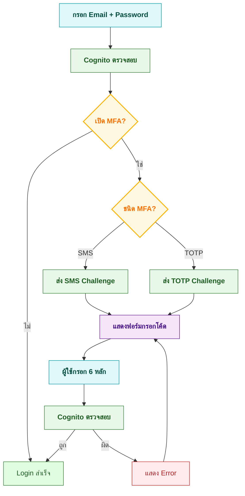
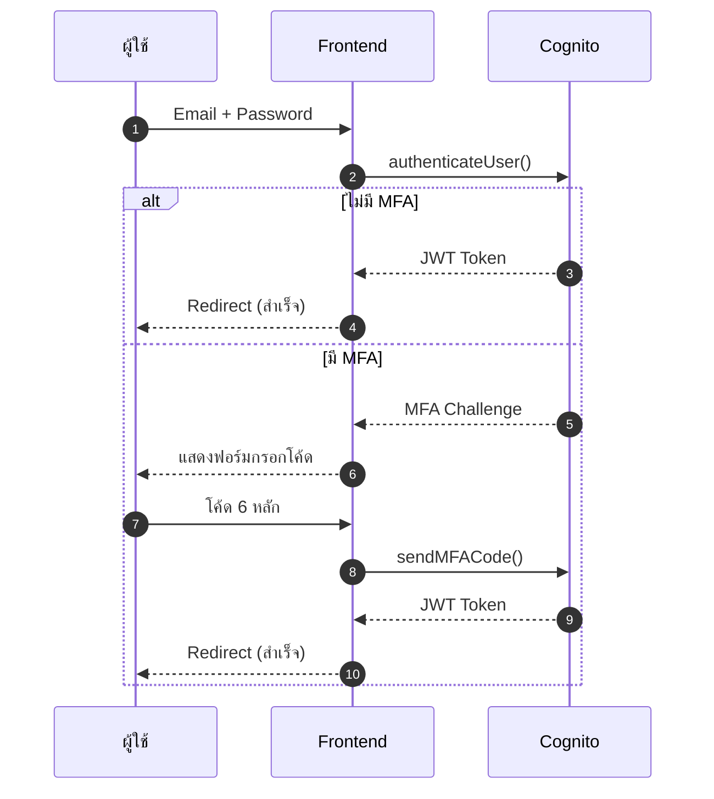

# วิธีเพิ่มความปลอดภัยด้วย Two-Factor Authentication (2FA) บน Next.js + Amazon Cognito

> **GitHub Repository**: โค้ดตัวอย่างครบทั้งโปรเจกต์สามารถดูได้ที่ [nextjs-aws-2fa](https://github.com/gamertense/nextjs-amazon-cognito)

## สารบัญ

1. [บทนำ](#introduction)
2. [2FA คืออะไร สำคัญยังไง](#what-is-2fa)
3. [ต้องเตรียมอะไรใน AWS Cognito](#setup-requirements)
4. [เข้าใจ Flow การล็อกอินแบบมี 2FA](#authentication-flow)
5. [สถาปัตยกรรมและไฟล์สำคัญ](#architecture)
6. [ขั้นตอนการทำ (Concepts)](#implementation-concepts)
7. [ทดสอบว่า 2FA ทำงานดี](#testing)
8. [ปัญหาที่มักเจอ + วิธีแก้](#troubleshooting)
9. [Tips ความปลอดภัยตอนขึ้น Production](#security)
10. [แหล่งอ้างอิง](#resources)

---

## บทนำ {#introduction}

บทความนี้จะพาทำ 2FA แบบใช้แอป Authenticator (TOTP) บน Next.js + Amazon Cognito ครับ สามารถใช้กับ Google Authenticator, Microsoft Authenticator, หรือ Authy ได้เลย

**สิ่งที่จะได้:**

- เข้าใจ flow การทำงานของ MFA Challenge
- รู้วิธีสร้าง QR Code สำหรับ Authenticator
- ตั้งค่า Cognito ให้รองรับ TOTP
- จัดการ error และ security best practices

> 💡 **โค้ดเต็มอยู่บน GitHub** - บทความนี้เน้นอธิบาย concepts และ key decisions ครับ ไม่ได้วางโค้ดทั้งหมด

---

## 2FA คืออะไร สำคัญยังไง {#what-is-2fa}

2FA (Two-Factor Authentication) = ใช้ "สองอย่าง" ยืนยันตัวตน:

1. **สิ่งที่รู้** – Email + Password
2. **สิ่งที่ถืออยู่** – โค้ด 6 หลักจากแอป Authenticator (เปลี่ยนทุก 30 วินาที)

**ทำไมต้องมี?**  
ต่อให้รหัสผ่านหลุดจากฟิชชิ่ง คนร้ายก็ยังเข้าไม่ได้ เพราะไม่มีโค้ดจากมือถือคุณ

---

## ต้องเตรียมอะไรใน AWS Cognito {#setup-requirements}

### สิ่งที่ต้องมีใน AWS

- **Cognito User Pool** ตั้ง MFA เป็น "Optional"
- **App Client** เปิด Software Token MFA (TOTP)
- **User Pool ID** + **App Client ID**

> 📖 **วิธีตั้งค่าละเอียด**: ดู [aws-2fa-setup.md](aws-2fa-setup.md)

### Environment Variables

```bash
# .env.local
NEXT_PUBLIC_COGNITO_USER_POOL_ID=us-east-1_xxxxxxxxx
NEXT_PUBLIC_COGNITO_CLIENT_ID=xxxxxxxxxxxxxxxxxxxxxxxxxx
NEXT_PUBLIC_APP_NAME=YourAppName
```

> **ทำไมต้องมี `NEXT_PUBLIC`**: เพราะ Cognito SDK ทำงานฝั่ง client  
> **`APP_NAME`**: จะโชว์ในแอป Authenticator ให้รู้ว่าโค้ดนี้สำหรับระบบไหน

### Dependencies

```bash
npm install amazon-cognito-identity-js qrcode.react
npm install --save-dev @types/qrcode
```

---

## เข้าใจ Flow การล็อกอินแบบมี 2FA {#authentication-flow}

### Flow Diagram



### Sequence Diagram



---

## สถาปัตยกรรมและไฟล์สำคัญ {#architecture}

```
src/
├── config/
│   └── cognito.ts              # User Pool configuration
├── services/
│   └── auth.ts                 # ฟังก์ชัน MFA ทั้งหมด
├── components/
│   ├── LoginForm.tsx           # ฟอร์มล็อกอิน
│   ├── MfaVerificationForm.tsx # ฟอร์มกรอกโค้ด MFA
│   ├── AuthenticatorSetup.tsx  # สร้าง QR Code
│   └── VerifyAuthenticator.tsx # ยืนยัน + เปิดใช้งาน
├── types/
│   └── cognito-errors.ts       # Error type guards
└── pages/
    ├── login.tsx               # Orchestrate login flow
    └── setup-2fa.tsx           # Setup 2FA flow
```

### ฟังก์ชันหลักใน `services/auth.ts`

| Function                    | Purpose                       | Returns                 |
| --------------------------- | ----------------------------- | ----------------------- |
| `signIn()`                  | Login + ตรวจจับ MFA Challenge | `Token \| MfaChallenge` |
| `submitMfaCode()`           | ส่งโค้ด MFA ไปตรวจสอบ         | `Token`                 |
| `setupAuthenticatorApp()`   | ขอ secret key จาก Cognito     | `secretCode`            |
| `verifyAuthenticatorCode()` | ยืนยันโค้ดแรก                 | `void`                  |
| `setPreferredMfaMethod()`   | ตั้งวิธี MFA หลัก             | `void`                  |

---

## ขั้นตอนการทำ

### 1. Cognito Configuration

สร้าง User Pool connection:

```typescript
// config/cognito.ts
import { CognitoUserPool } from "amazon-cognito-identity-js";

export const userPool = new CognitoUserPool({
  UserPoolId: process.env.NEXT_PUBLIC_COGNITO_USER_POOL_ID || "",
  ClientId: process.env.NEXT_PUBLIC_COGNITO_CLIENT_ID || "",
});
```

---

### 2. MFA Challenge Detection

**Concept หลัก**: Cognito callbacks บอกสถานะ authentication

```typescript
cognitoUser.authenticateUser(authDetails, {
  onSuccess: (result) => {
    // ไม่มี MFA หรือ trusted device
    return result.getIdToken().getJwtToken();
  },
  totpRequired: (challengeName, params) => {
    // ต้องใช้ Authenticator app
    return { email, password, challengeName, params };
  },
  mfaRequired: (challengeName, params) => {
    // ต้องใช้ SMS
    return { email, password, challengeName, params };
  },
  onFailure: (err) => reject(err),
});
```

> 💡 **ทำไมเก็บ `email` + `password` ใน Challenge?**  
> เพราะตอนส่ง MFA code ต้อง re-authenticate กับ Cognito อีกรอบ

**Type Definition**:

```typescript
export interface MfaChallenge {
  email: string;
  password: string;
  challengeName: "SMS_MFA" | "SOFTWARE_TOKEN_MFA";
  challengeParameters: {
    CODE_DELIVERY_DESTINATION?: string;
  };
}
```

[ดูโค้ดเต็ม `signIn()`](https://github.com/gamertense/nextjs-amazon-cognito/blob/main/src/services/auth.ts)

---

### 3. Component Integration Pattern

**Page-level orchestration** (ไม่ใช่ component-level):

```typescript
// pages/login.tsx
const [mfaChallenge, setMfaChallenge] = useState<MfaChallenge | null>(null);

const handleLogin = async (email: string, password: string) => {
  const result = await signIn(email, password);

  if (typeof result === "string") {
    // Got token directly
    saveToken(result);
    router.push("/home");
  } else {
    // Got MFA challenge
    setMfaChallenge(result);
  }
};

// Conditional rendering
{
  !mfaChallenge ? (
    <LoginForm onLoginSuccess={handleLogin} />
  ) : (
    <MfaVerificationForm
      mfaChallenge={mfaChallenge}
      onSuccess={() => router.push("/home")}
    />
  );
}
```

> ⚠️ **Common Mistake**: อย่าใส่ logic routing ใน component - ใช้ callback props แทน

[ดูโค้ดเต็ม Components](https://github.com/gamertense/nextjs-amazon-cognito/tree/main/src/components)

---

### 4. QR Code Generation

**Concept**: สร้าง `otpauth://` URI สำหรับ Authenticator apps

**ขั้นตอน**:

1. ขอ `secretCode` จาก Cognito
2. สร้าง URI format ตามมาตรฐาน
3. แปลงเป็น QR Code ด้วย `qrcode.react`

```typescript
const secret = await setupAuthenticatorApp(); // Get from Cognito

const otpauthUri = `otpauth://totp/${encodeURIComponent(
  issuer
)}:${encodeURIComponent(email)}?secret=${secret}&issuer=${encodeURIComponent(
  issuer
)}`;

// Render QR
<QRCodeSVG value={otpauthUri} size={200} />;
```

**URI Structure**:

```
otpauth://totp/MyApp:user@example.com?secret=SECRETKEY&issuer=MyApp
         │     │                        │              │
         │     └─ Issuer:Account        └─ TOTP secret └─ App name
         └─ Protocol (TOTP)
```

[ดูโค้ดเต็ม QR Generation](https://github.com/gamertense/nextjs-amazon-cognito/blob/main/src/components/AuthenticatorSetup.tsx)

---

### 5. Verification & Activation

**2 ขั้นตอนสำคัญ**:

```typescript
// 1. ยืนยันโค้ดแรกจาก Authenticator
await verifyAuthenticatorCode(code, "DeviceName");

// 2. ตั้งให้ TOTP เป็นวิธี MFA หลัก
await setPreferredMfaMethod("SOFTWARE_TOKEN_MFA");
```

**Cognito callbacks**:

```typescript
cognitoUser.verifySoftwareToken(code, deviceName, {
  onSuccess: () => {
    /* ยืนยันสำเร็จ */
  },
  onFailure: (err) => {
    /* โค้ดผิด */
  },
});

cognitoUser.setUserMfaPreference(smsSettings, totpSettings, callback);
```

---

### 6. Error Handling

**Best Practice**: ใช้ type guards แยกประเภท error

```typescript
// types/cognito-errors.ts
type CognitoAuthErrorCode =
  | "UserNotConfirmedException"
  | "NotAuthorizedException"
  | "UserNotFoundException"
  | "CodeMismatchException"
  | "ExpiredCodeException"
  | "InvalidParameterException"
  | "UsernameExistsException";

export type CognitoAuthError = {
  message: string;
  code: CognitoAuthErrorCode;
};

export const isCognitoAuthError = (error: unknown): error is CognitoAuthError =>
  typeof error === "object" &&
  error !== null &&
  "code" in error &&
  "message" in error;

export const isCognitoCodeMismatchError = (error: unknown): boolean => {
  return isCognitoAuthError(error) && error.code === "CodeMismatchException";
};

export const isExpiredCodeError = (error: unknown): boolean => {
  return isCognitoAuthError(error) && error.code === "ExpiredCodeException";
};

export const isNotAuthorizedError = (error: unknown): boolean => {
  return isCognitoAuthError(error) && error.code === "NotAuthorizedException";
};
```

**ใช้งาน**:

```typescript
try {
  await submitMfaCode(email, password, code, challengeName);
} catch (error) {
  if (isCognitoCodeMismatchError(error)) {
    setError("รหัสไม่ถูกต้อง กรุณาลองใหม่");
  } else if (isExpiredCodeError(error)) {
    setError("โค้ดนี้ถูกใช้ไปแล้ว รอโค้ดใหม่จากแอป");
  } else {
    setError("เกิดข้อผิดพลาด");
  }
}
```

[ดูโค้ดเต็ม Error Handling](https://github.com/gamertense/nextjs-amazon-cognito/blob/main/src/types/cognito-errors.ts)

---

## ทดสอบว่า 2FA ทำงานถูกต้อง {#testing}

### Setup 2FA

1. เข้าหน้า Setup 2FA → กดปุ่ม **Set Up Authenticator App**
2. กรอก email → กด **Generate QR Code**
3. สแกน QR ด้วย Google Authenticator / Microsoft Authenticator
4. ตรวจสอบชื่อแอปตรงกับ `NEXT_PUBLIC_APP_NAME`
5. กด **Continue to Verification**
6. กรอกโค้ด 6 หลัก → กด **Verify and Enable 2FA**
7. เห็นข้อความ "Authenticator setup successful!"

### Test Login

1. Logout แล้ว login ใหม่ด้วย email ที่เปิด 2FA
2. หลังใส่รหัสผ่าน จะเห็นฟอร์มกรอกโค้ด MFA
3. กรอกโค้ดจากแอป Authenticator
4. Login สำเร็จ → redirect ไปหน้า home

---

## ปัญหาที่มักเจอ + วิธีแก้ {#troubleshooting}

### MFA เปิดอยู่แล้ว ไม่สามารถ setup ใหม่ได้

**อาการ**: Error "Software token MFA is already enabled"

**วิธีแก้**:

1. ไปที่ AWS Cognito Console
2. Users → ค้นหาบัญชี → Actions → **Update MFA configuration**
3. เลือก **MFA inactive** → Save

---

### เว็บไม่ถาม MFA แม้เปิดใช้แล้ว

**สาเหตุ**: Device tracking จำเครื่องไว้แล้ว

**วิธีแก้**:

- **Option 1**: ปิด "Trust remembered devices" ใน Cognito Console
- **Option 2**: Forget device ของ user นั้น (Actions → Forget device)

---

### โค้ดถูกแต่ยัง error "Code mismatch"

**สาเหตุที่เป็นไปได้**:

- เวลาเครื่องไม่ตรง (TOTP ใช้ time-based)
- ใช้โค้ดเดิมซ้ำ (แต่ละโค้ดใช้ได้ครั้งเดียว)
- ตั้งค่า Cognito ไม่ถูก (ไม่ได้เปิด TOTP)

**วิธีแก้**:

- ตรวจเวลาบนมือถือให้ตรง (sync กับ network time)
- รอโค้ดใหม่ (ประมาณ 30 วินาที)
- ตรวจสอบ User Pool settings

---

---

## Tips ความปลอดภัยตอนขึ้น Production {#security}

### 1. เก็บ Token ให้ปลอดภัย

ใช้ HttpOnly Cookies (ตั้งฝั่ง server)

```typescript
// ✅ API Route (server-side only)
// pages/api/auth/set-token.ts
export default function handler(req, res) {
  res.setHeader(
    "Set-Cookie",
    `authToken=${token}; HttpOnly; Secure; SameSite=Strict; Path=/; Max-Age=3600`
  );
  res.status(200).json({ success: true });
}
```

> ⚠️ **สำคัญ**: HttpOnly cookies **ไม่สามารถตั้งจาก client-side JavaScript ได้** - ต้องทำผ่าน API Route หรือ server response เท่านั้น

---

### 2. HTTPS เท่านั้น

```typescript
// next.config.ts
export default {
  async headers() {
    return [
      {
        source: "/:path*",
        headers: [
          {
            key: "Strict-Transport-Security",
            value: "max-age=63072000; includeSubDomains; preload",
          },
        ],
      },
    ];
  },
};
```

---

## แหล่งอ้างอิง {#resources}

### AWS Documentation

- [Amazon Cognito Developer Guide](https://docs.aws.amazon.com/cognito/)
- [Cognito Identity SDK for JavaScript](https://github.com/aws-amplify/amplify-js/tree/main/packages/amazon-cognito-identity-js)
- [MFA Configuration Guide](https://docs.aws.amazon.com/cognito/latest/developerguide/user-pool-settings-mfa.html)

### Standards & Specs

- [RFC 6238 – TOTP Specification](https://tools.ietf.org/html/rfc6238)
- [OWASP MFA Cheat Sheet](https://cheatsheetseries.owasp.org/cheatsheets/Multifactor_Authentication_Cheat_Sheet.html)

### GitHub Repository

- [Full Source Code](https://github.com/gamertense/nextjs-amazon-cognito)

---

## สรุป

เพิ่ม 2FA ด้วย Authenticator ทำให้ระบบคุณปลอดภัยขึ้นเยอะมากครับ ต่อให้รหัสผ่านหลุด ผู้โจมตีก็ยังต้องผ่านด่านโค้ดที่เปลี่ยนทุก 30 วินาทีอยู่ดี

**ใจความหลัก:**

- ความปลอดภัยเพิ่ม ไม่ยุ่งยากเกินไป
- ผู้ใช้ตั้งค่าง่ายด้วย QR Code สแกนจบ
- ปล่อยให้ Cognito ดูแลงานยากๆ (โทเคน / session / scale)
- ถ้าเก็บ token ดี ก็พร้อมขึ้น production ได้เลยครับ

ขอให้สนุกกับการทำ 2FA ครับ! 🔐
